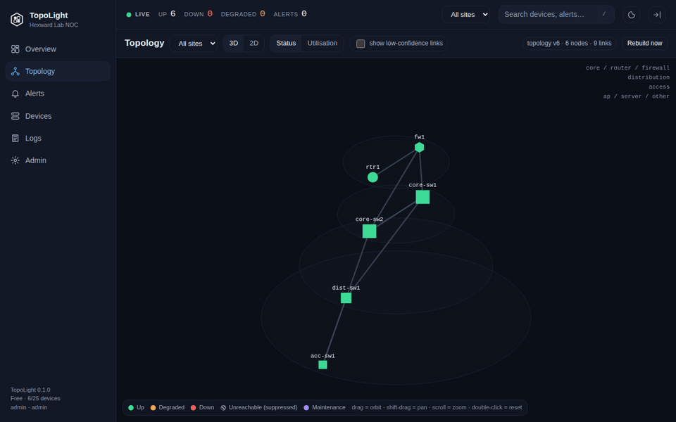

# TopoLight

**Self-hosted network monitoring with a live LLDP topology map — one static binary, no database server, no agents, no telemetry.**

TopoLight watches your switches, routers, firewalls and access points over ICMP and SNMP (v2c/v3), draws the physical topology from what the devices themselves report over LLDP/CDP, listens to their syslog and traps, and tells you *what is down, where, and why* — with the downstream noise folded under the root cause.



> Free edition: 25 devices, 1 site, 7-day retention, everything else included.
> Pro (500 devices, 3 sites, 6 months) and Team (1,500 devices, unlimited sites, 12 months, roles) are on
> [Whop](https://whop.com/nizar-tuanku/topolight?utm_source=github) — same binary, a licence key unlocks the caps offline.

## What you get

- **Discovery** — sweep subnets or ranges (ICMP then SNMP with every credential you saved); LLDP/CDP neighbours are followed automatically; manual add for the odd device.
- **Health** — ICMP RTT/loss/jitter; SNMP sysUpTime, IF-MIB 64-bit counters (rates, utilisation, errors), HOST-RESOURCES, ENTITY-MIB serial/model; vendor CPU/memory/temperature through built-in profiles (Cisco IOS/NX-OS/ASA, FortiGate, Palo Alto, Juniper, Aruba AOS-S/CX, MikroTik, Huawei, Ubiquiti, net-snmp) plus your own JSON profiles.
- **Topology** — links synthesised from both ends of every LLDP/CDP observation with a confidence score; roles (core / distribution / access) inferred from the graph; a **3D stacked-disc map** rendered on a plain canvas (no WebGL, no JavaScript framework) with a 2D mode, orbit, zoom, status and utilisation overlays, live updates.
- **Intake** — syslog UDP/TCP (RFC 3164 and 5424, Cisco mnemonics, FortiGate key=value) and SNMP v2c traps/informs; interesting lines become events (link down/up, config change, BGP/OSPF neighbour, HA state, environment, auth failure, log flood).
- **State engine** — per-device and per-interface state machine with confirmation cycles, hysteresis, flap detection, **topology-aware suppression** (a device behind a dead uplink is *unreachable*, not *down*, and its alert folds under the root cause), site-down collapse, maintenance windows, dedup and re-open.
- **Notify** — e-mail (SMTP/STARTTLS), Telegram bot, HMAC-signed webhook; grouping, quiet hours, minimum severity.
- **Console** — overview, topology, alerts (keyboard: `j`/`k`/`a`/`r`), devices and device detail with 24-hour graphs, log explorer with histogram, admin (sites, credentials, notifications, rules, maintenance, users, licence). Dark and light themes, WCAG AA, command palette on `/`.
- **Storage** — embedded: a JSON snapshot for inventory/topology/alerts, JSONL journals for events and logs (daily, gzip), and a small purpose-built time-series store (60-second raw for 30 days, 5-minute rollups to the retention limit). Nothing to install, nothing to tune.
- **Setup** — a five-step wizard gets the first devices on the map in a few minutes; per-vendor config snippets (SNMP, LLDP, syslog, trap) are generated for you.

## Quick start

Linux (amd64/arm64):

```sh
curl -fsSL https://raw.githubusercontent.com/nizartuanku/topolight/main/install.sh | sudo sh
# → console on http://<host>:8432 — open it and follow the wizard
```

Docker (build the image from this repo — a published `hexward/topolight` image follows once it has been through the same checks):

```sh
docker build -t topolight:0.1.0 .
docker run -d --name topolight \
  -p 8432:8432 -p 514:514/udp -p 514:514 -p 162:162/udp \
  -v topolight-data:/data \
  topolight:0.1.0
```

Or download the tarball from [Releases](https://github.com/nizartuanku/topolight/releases), verify `SHA256SUMS`, and run `./topolight` — everything is flags, `topolight -h` lists them. See [docs/INSTALL.md](docs/INSTALL.md) for systemd, TLS, ports and unprivileged ICMP.

Build from source (Go 1.24, no dependencies beyond the standard library):

```sh
git clone https://github.com/nizartuanku/topolight && cd topolight
CGO_ENABLED=0 go build -o topolight ./cmd/topolight
```

## How it decides something is down

1. Every poll cycle produces a sample: ICMP answered? SNMP answered? counters, CPU, memory.
2. A device becomes **DOWN** only after `N` consecutive failed cycles (default 3); it becomes **UP** again after 2 good ones. Threshold rules (CPU, memory, temperature, loss, latency, interface utilisation/errors) have separate enter and exit values so a value hovering at the line does not flap.
3. When a device goes down, TopoLight walks the LLDP graph from your core: every device whose only path runs through the failed one is marked **UNREACHABLE (suppressed)** and its alert is folded under the root cause. You get one alert with "3 downstream devices", not four.
4. Traps and syslog are treated as *hard* evidence: a linkDown trap marks the interface down immediately and triggers a confirming poll; if the device says the port is up again, the alert clears itself.
5. Everything is a rule you can edit (thresholds, cycles, severity, important-interfaces-only) — see the Admin → Alert rules page.

## Editions

| | Free (this repo) | Pro | Team |
|---|---|---|---|
| Monitored devices | 25 | 500 | 1,500 |
| Sites | 1 | 3 | unlimited |
| Metric and log retention | 7 days | 6 months | 12 months |
| Users | 1 | 3 | unlimited, admin / operator / viewer roles |
| ICMP + SNMP v2c/v3, LLDP/CDP topology 2D + 3D, syslog + traps, state engine, e-mail | ✓ | ✓ | ✓ |
| Telegram + signed webhook | — | ✓ | ✓ |
| Maintenance windows, export API | — | ✓ | ✓ |
| Price | $0 | $49 | $149 |

Caps are enforced honestly: over the limit, discovery still lists the device but marks it *not monitored* and the API answers `402` with a readable message. The licence is an offline Ed25519 key — no phone-home, no account. [Get a key on Whop](https://whop.com/nizar-tuanku/topolight?utm_source=github) (14-day trial).

## Honest limits

Read these before you rely on it.

- **Topology comes from LLDP/CDP.** Devices that do not speak either (many ISP CPEs, unmanaged switches, most servers) appear only as *external* nodes or via a manual link. ARP/FDB-based endpoint placement is planned, not shipped.
- **Traps are SNMP v2c only** in this release (v3 traps and syslog over TLS are on the list). Polling supports v3 authPriv (SHA/SHA-256/MD5 + AES-128/DES).
- **Metrics are 60-second resolution** for 30 days, then 5-minute averages/min/max until the retention limit. It is not a flow collector: NetFlow/IPFIX/sFlow are not part of 0.1.
- **Logs are a searchable journal, not a SIEM.** Filter by device, severity, text and time window; no correlation rules, no long-term analytics.
- **ICMP on Linux needs** either `CAP_NET_RAW` or the unprivileged ping group range (`sysctl net.ipv4.ping_group_range`); the installer sets the capability. On other operating systems TopoLight runs in SNMP-only reachability mode and says so on the Overview.
- **Ports 514 and 162 are privileged.** The installer grants `cap_net_bind_service`; otherwise use `-syslog-listen :5514 -trap-listen :1162` and point devices there.
- **Sizing** — measured, not guessed: a 1,500-device simulated estate polled every 60 s uses about a quarter of one CPU core and ~110 MB of RAM. History costs ≈4.5 KB per series per day at 60-second resolution and ≈1.8 KB per series per day at 5-minute resolution (worst case; idle ports compress far better) — see [docs/INSTALL.md](docs/INSTALL.md#1-sizing) for what that means for your estate. Remote collectors and HA are v0.2 work.
- **Read-only by design.** TopoLight never pushes configuration to a device.

## Configuration

Everything is a flag or an environment variable (`topolight -h`). The ones you will meet first:

```
-listen 127.0.0.1:8432      console address (0.0.0.0:8432 to serve the network; put TLS or a reverse proxy in front)
-data ~/.topolight          state, metrics, logs, licence
-syslog-listen :514         syslog UDP+TCP ("" disables)
-trap-listen :162           SNMP trap UDP ("" disables)
-license SNTL1-...          licence key (or TOPOLIGHT_LICENSE, or <data>/license.key, or paste it in Admin → Licence)
-smtp-host / -smtp-from     e-mail notifications;  -telegram-token, -webhook-secret for the others
-tls-cert / -tls-key        serve HTTPS directly
```

Security notes: the console needs a login from the first request; passwords are PBKDF2-SHA256 (600k); sessions are HttpOnly + SameSite=Strict; state-changing requests are same-origin only; CSP forbids inline and remote scripts; SNMP credentials are stored on disk under the data directory (mode 0600) and never returned by the API.

## Documentation

- [docs/INSTALL.md](docs/INSTALL.md) — install, upgrade, systemd, Docker, ports, TLS, backups
- [docs/USER-GUIDE.md](docs/USER-GUIDE.md) — wizard, discovery, topology, alerts, rules, notifications, profiles, licence
- [docs/SPEC-v0.md](docs/SPEC-v0.md) — scope and architecture of v0.1 ([Bahasa Indonesia](docs/SPEC-v0.ID.md))
- [CHANGELOG.md](CHANGELOG.md)

## Contributing

Bug reports with the `Admin → System` block pasted in are the most useful thing you can send. Pull requests are welcome; run `go vet ./... && go test -race ./...` first. The only hard rule: no new dependencies — the binary stays standard-library only.

## Licence

Apache License 2.0 — see [LICENSE](LICENSE).

---

Part of the **Hexward** line of self-hosted tools ·
[Whop](https://whop.com/nizar-tuanku/topolight?utm_source=github) ·
[Instagram](https://instagram.com/nizartuanku) ·
[YouTube](https://youtube.com/@nizartuanku) ·
[TikTok](https://tiktok.com/@nizartuanku)
